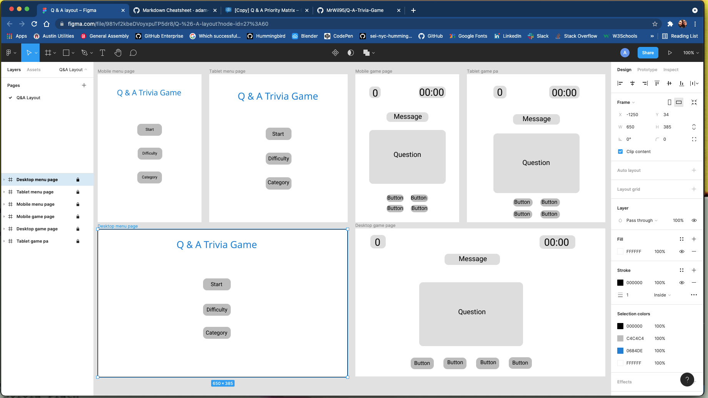
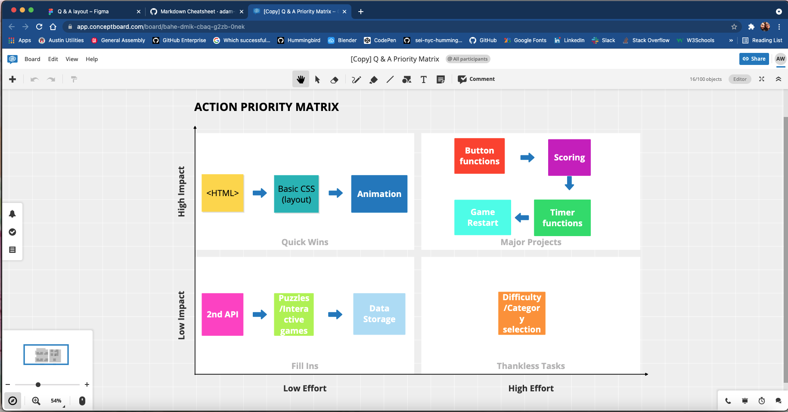

# Project Overview

## Project Name

Q&A Trivia Game

## Project Description

The end goal, here, is to build a trivia game that will test the players' knowledge on different categories. I will impliment buttons for the player to click in order to select the right answer to any given question. There will be a points system incorporated along with a timer function. I am going to add a menu with a start button to trigger the timer and start the test, a difficulty setting will be added to spice things up a bit, and a category section to get some juicy topics. The more questions that are answered correctly the higher your score will go. If the score is more than x when the timer is done, display "congratulations!" otherwise display "sorry, better luck next time." Before the trivia begins player must enter name. At the end of the game you will get the option to start over or select category

## API and Data Sample

https://opentdb.com/api.php?amount=10

```{
    "response_code": 0,
    "results": [
        {
            "category": "Entertainment: Video Games",
            "type": "boolean",
            "difficulty": "easy",
            "question": "Peter Molyneux was the founder of Bullfrog Productions.",
            "correct_answer": "True",
            "incorrect_answers": [
                "False"
            ]
        },
        {
            "category": "Entertainment: Books",
            "type": "multiple",
            "difficulty": "medium",
            "question": "What was the pen name of novelist, Mary Ann Evans?",
            "correct_answer": "George Eliot",
            "incorrect_answers": [
                "George Orwell",
                "George Bernard Shaw",
                "George Saunders"
            ]
        },
        {
            "category": "Entertainment: Film",
            "type": "multiple",
            "difficulty": "medium",
            "question": "This movie contains the quote, &quot;I love the smell of napalm in the morning!&quot;",
            "correct_answer": "Apocalypse Now",
            "incorrect_answers": [
                "Platoon",
                "The Deer Hunter",
                "Full Metal Jacket"
            ]
        },
        {
            "category": "Entertainment: Film",
            "type": "multiple",
            "difficulty": "easy",
            "question": "This movie contains the quote, &quot;Nobody puts Baby in a corner.&quot;",
            "correct_answer": "Dirty Dancing",
            "incorrect_answers": [
                "Three Men and a Baby",
                "Ferris Bueller&#039;s Day Off",
                "Pretty in Pink"
            ]
        },
        {
            "category": "General Knowledge",
            "type": "multiple",
            "difficulty": "medium",
            "question": "Which of the following Ivy League universities has its official motto in Hebrew as well as in Latin?",
            "correct_answer": "Yale University",
            "incorrect_answers": [
                "Princeton University",
                "Harvard University",
                "Columbia University"
            ]
        },
        {
            "category": "Entertainment: Video Games",
            "type": "multiple",
            "difficulty": "medium",
            "question": "The default playermodel of Garry&#039;s Mod is this Half Life 2 character.",
            "correct_answer": "Isaac Kleiner",
            "incorrect_answers": [
                "G-Man",
                "Alyx Vance",
                "Gordon Freeman"
            ]
        },
        {
            "category": "Entertainment: Books",
            "type": "multiple",
            "difficulty": "easy",
            "question": "What is the name of Sherlock Holmes&#039;s brother?",
            "correct_answer": "Mycroft Holmes",
            "incorrect_answers": [
                "Mederi Holmes",
                "Martin Holmes",
                "Herbie Hancock Holmes"
            ]
        },
        {
            "category": "Entertainment: Japanese Anime & Manga",
            "type": "multiple",
            "difficulty": "hard",
            "question": "In &quot;Hunter x Hunter&quot;, which of the following is NOT a type of Nen aura?",
            "correct_answer": "Restoration",
            "incorrect_answers": [
                "Emission",
                "Transmutation",
                "Specialization"
            ]
        },
        {
            "category": "Geography",
            "type": "multiple",
            "difficulty": "hard",
            "question": "In which country is Tallinn located?",
            "correct_answer": "Estonia",
            "incorrect_answers": [
                "Finland",
                "Sweden",
                "Poland"
            ]
        },
        {
            "category": "Entertainment: Video Games",
            "type": "multiple",
            "difficulty": "hard",
            "question": "Which of these characters from Final Fantasy VIII primarily spoke in one word sentences?",
            "correct_answer": "Fujin",
            "incorrect_answers": [
                "Raijin",
                "Seifer",
                "Zell"
            ]
        }
    ]
}
```

## Wireframes



https://www.figma.com/file/981vf2kbeDVoyxpuTP5dr8/Q-and-A-layout?node-id=4%3A125

### MVP/PostMVP


#### MVP 

- On button.click {
	-test start
	-timer start
	-answer generated/assesed
	-animation start
}
- Timer count down
- when timer = 00:00 end game
- responsive style
- animations
- Points system incrementation when answer = true 
- if questions answered correct === x end game display congratulations, perfect score!
- if questions correct > x when timer ends display congratulations! else, sorry, try again!
 

#### PostMVP  

- retry or select category function
- Add second API
- Add puzzles and interactive games
- Add data storage
- Difficulty setting
- Category selection

## Project Schedule

|  Day | Deliverable | Status
|---|---| ---|
|August 28| Prompt / Wireframes / Priority Matrix / Timeframes | Complete
|August 30| Project Approval | Incomplete
|August 30| Core Application Structure (HTML, CSS, etc.) | Incomplete
|August 31| Pseudocode / actual code | Incomplete
|September 1| Initial Clickable Model  | Incomplete
|September 2| MVP | Incomplete
|| Presentations | Incomplete

## Priority Matrix


https://app.conceptboard.com/board/bahe-dmik-cbaq-g2zb-0nek

## Timeframes

| Component | Priority | Estimated Time | Time Invested | Actual Time |
| --- | :---: |  :---: | :---: | :---: |
| HTML, CSS(layout) | H | 2hrs |  |  |
| Working with API | H | 3hrs |  |  |
| Start game function | H | 2hrs |  |  |
| Timer start | H | 2hrs |  |  |
| Timer end | H | 2hrs |  |  |
| Scoring | H | 2hrs |  |  |
| Scoring end game | H | 2hrs |  |  |
| End game function | H | 3hrs |  |  |
| Animation | M | 3hrs |  |  |
| PostMVP | L-M | 4hrs |  |  |
| Debugging | L-M | 4hrs |  |  |
| Total | H | 32hrs |  |  |


## Code Snippet

Use this section to include a brief code snippet of functionality that you are proud of and a brief description.  

```
function reverse(string) {
	// here is the code to reverse a string of text
}
```

## Change Log
 Use this section to document what changes were made and the reasoning behind those changes.  
